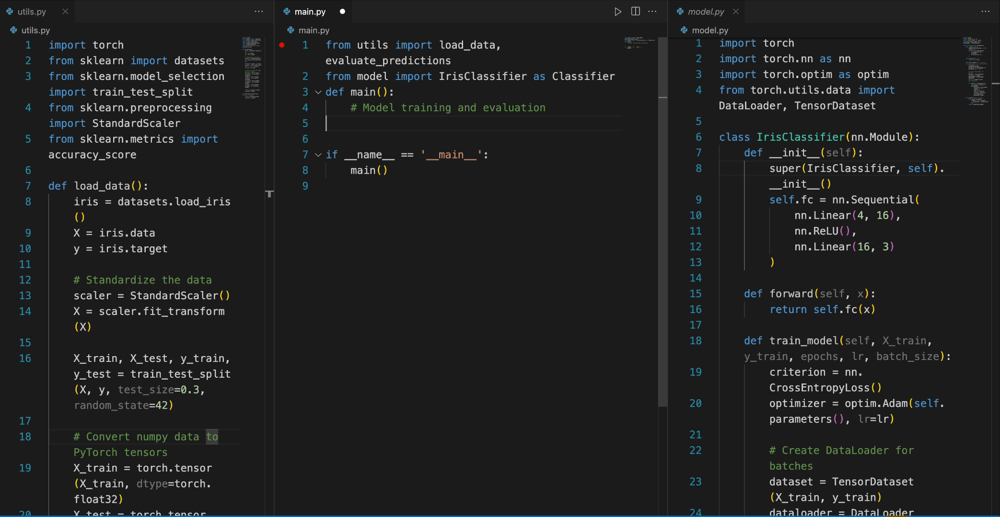
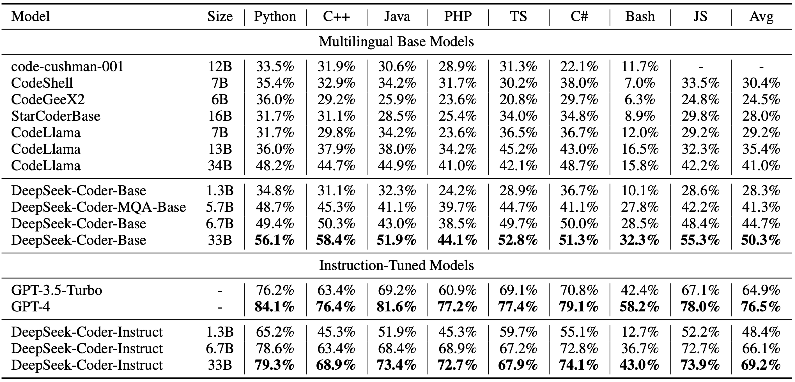

<p align="center">

</p>
<p align="center"><a href="https://www.deepseek.com/">[ Homepage]</a> | <a href="https://coder.deepseek.com/">[🤖 Chat with DeepSeek Coder]</a> | <a href="https://huggingface.co/deepseek-ai">[🤗 Models Download]</a> | <a href="https://discord.gg/Tc7c45Zzu5">[Discord]</a> | <a href="https://github.com/guoday/assert/blob/main/QR.png?raw=true">[WeChat (微信)]</a></p>
<hr>


### 1. Introduction of DeepSeek Coder

DeepSeek Coder is composed of a series of code language models, each trained from scratch on 2T tokens, with a composition of 87% code and 13% natural language in both English and Chinese. We provide various sizes of the code model, ranging from 1B to 33B versions. Each model is pre-trained on project-level code corpus by employing a window size of 16K and an extra fill-in-the-blank task, to support project-level code completion and infilling. For coding capabilities, DeepSeek Coder achieves state-of-the-art performance among open-source code models on multiple programming languages and various benchmarks.

<p align="center">

</p>

- **Massive Training Data**: Trained from scratch on 2T tokens, including 87% code and 13% linguistic data in both English and Chinese languages.

- **Highly Flexible & Scalable**: Offered in model sizes of 1B, 5.7B, 6.7B and 33B, enabling users to choose the setup most suitable for their requirements.

- **Superior Model Performance**: State-of-the-art performance among publicly available code models on HumanEval, MultiPL-E, MBPP, DS-1000, and APPS benchmarks.

- **Advanced Code Completion Capabilities**: A window size of 16K and a fill-in-the-blank task, supporting project-level code completion and infilling tasks.


### 2. Evaluation Results
We evaluate DeepSeek Coder on various coding-related benchmarks.
Only `pass@1` results on HumanEval (Python and Multilingual), MBPP, and DS-1000 are reported here:

<p align="center">

</p>


The result shows that DeepSeek-Coder-Base-33B significantly outperforms existing open-source code LLMs. Compared with CodeLlama-34B, it leads by 7.9%, 9.3%, 10.8% and 5.9% respectively on HumanEval Python, HumanEval Multilingual, MBPP and DS-1000.
Surprisingly, our DeepSeek-Coder-Base-7B reaches the performance of CodeLlama-34B.
The DeepSeek-Coder-Instruct-33B model after instruction tuning outperforms GPT35-turbo on HumanEval and achieves comparable results with GPT35-turbo on MBPP.

More evaluation details can be found in the [Detailed Evaluation](#5-detailed-evaluation-results).


### 3. Procedure of Data Creation and Model Training

#### Data Creation

- Step 1: Collect code data from GitHub and apply the same filtering rules as [StarCoder Data](https://github.com/bigcode-project/bigcode-dataset) to filter data.
- Step 2: Parsing the dependencies of files within the same repository to rearrange the file positions based on their dependencies.
- Step 3: Concatenating dependent files to form a single example and employ repo-level minhash for deduplication.
- Step 4: Further filtering out low-quality code, such as codes with syntax errors or poor readability.


#### Model Training

- Step 1: Initially pre-trained with a dataset consisting of 87% code, 10% code-related language (Github Markdown and StackExchange), and 3% non-code-related Chinese language. Models are pre-trained using 1.8T tokens and a 4K window size in this step.
- Step 2: Further Pre-training using an extended 16K window size on an additional 200B tokens, resulting in foundational models (**DeepSeek-Coder-Base**).
- Step 3: Instruction Fine-tuning on 2B tokens of instruction data, resulting in instruction-tuned models (**DeepSeek-Coder-Instruct**).


### 4. How to Use
Before proceeding, you'll need to install the necessary dependencies. You can do this by running the following command:
```
pip install -r requirements.txt
```
A demo is also available on the [🤗 Hugging Face Space](https://huggingface.co/spaces/deepseek-ai/deepseek-coder-33b-instruct), and you can run the demo locally using `app.py` in the [demo](https://github.com/deepseek-ai/deepseek-coder/tree/main/demo) folder.  (Thanks to all the HF team for their support)

Here are some examples of how to use our model.

#### 1) Code Completion
```python
from transformers import AutoTokenizer, AutoModelForCausalLM
import torch
tokenizer = AutoTokenizer.from_pretrained("deepseek-ai/deepseek-coder-6.7b-base", trust_remote_code=True)
model = AutoModelForCausalLM.from_pretrained("deepseek-ai/deepseek-coder-6.7b-base", trust_remote_code=True).cuda()
input_text = "#write a quick sort algorithm"
inputs = tokenizer(input_text, return_tensors="pt").to(model.device)
outputs = model.generate(**inputs, max_length=128)
print(tokenizer.decode(outputs[0], skip_special_tokens=True))
```
This code will output the following result:
```
def quick_sort(arr):
    if len(arr) <= 1:
        return arr
    pivot = arr[0]
    left = []
    right = []
    for i in range(1, len(arr)):
        if arr[i] < pivot:
            left.append(arr[i])
        else:
            right.append(arr[i])
    return quick_sort(left) + [pivot] + quick_sort(right)
```

#### 2) Code Insertion
```python
from transformers import AutoTokenizer, AutoModelForCausalLM
import torch
tokenizer = AutoTokenizer.from_pretrained("deepseek-ai/deepseek-coder-6.7b-base", trust_remote_code=True)
model = AutoModelForCausalLM.from_pretrained("deepseek-ai/deepseek-coder-6.7b-base", trust_remote_code=True).cuda()
input_text = """<｜fim▁begin｜>def quick_sort(arr):
    if len(arr) <= 1:
        return arr
    pivot = arr[0]
    left = []
    right = []
<｜fim▁hole｜>
        if arr[i] < pivot:
            left.append(arr[i])
        else:
            right.append(arr[i])
    return quick_sort(left) + [pivot] + quick_sort(right)<｜fim▁end｜>"""
inputs = tokenizer(input_text, return_tensors="pt").to(model.device)
outputs = model.generate(**inputs, max_length=128)
print(tokenizer.decode(outputs[0], skip_special_tokens=True)[len(input_text):])
```
This code will output the following result:
```
   for i in range(1, len(arr)):
```

#### 3) Chat Model Inference
```python
from transformers import AutoTokenizer, AutoModelForCausalLM
tokenizer = AutoTokenizer.from_pretrained("deepseek-ai/deepseek-coder-6.7b-instruct", trust_remote_code=True)
model = AutoModelForCausalLM.from_pretrained("deepseek-ai/deepseek-coder-6.7b-instruct", trust_remote_code=True).cuda()
messages=[
    { 'role': 'user', 'content': "write a quick sort algorithm in python."}
]
inputs = tokenizer.apply_chat_template(messages, return_tensors="pt").to(model.device)
# 32021 is the id of <|EOT|> token
outputs = model.generate(inputs, max_new_tokens=512, do_sample=False, top_k=50, top_p=0.95, num_return_sequences=1, eos_token_id=32021)
print(tokenizer.decode(outputs[0][len(inputs[0]):], skip_special_tokens=True))
```
This code will output the following result:
```
Sure, here is a simple implementation of the Quick Sort algorithm in Python:

def quick_sort(arr):
    if len(arr) <= 1:
        return arr
    else:
        pivot = arr[0]
        less_than_pivot = [x for x in arr[1:] if x <= pivot]
        greater_than_pivot = [x for x in arr[1:] if x > pivot]
        return quick_sort(less_than_pivot) + [pivot] + quick_sort(greater_than_pivot)

# Test the function
arr = [10, 7, 8, 9, 1, 5]
print("Original array:", arr)
print("Sorted array:", quick_sort(arr))

This code works by selecting a 'pivot' element from the array and partitioning the other elements into two sub-arrays, according to whether they are less than or greater than the pivot. The pivot element is then in its final position. The process is then repeated for the sub-arrays.
```

If you don't want to use the provided API `apply_chat_template` which loads the template from `tokenizer_config.json`, you can use the following template to chat with our model. Replace the `['content']` with your instructions and the model's previous (if any) responses, then the model will generate the response to the currently given instruction.
```
You are an AI programming assistant, utilizing the DeepSeek Coder model, developed by DeepSeek Company, and you only answer questions related to computer science. For politically sensitive questions, security and privacy issues, and other non-computer science questions, you will refuse to answer.
### Instruction:
['content']
### Response:
['content']
<|EOT|>
### Instruction:
['content']
### Response:

```

#### 4) Repository Level Code Completion
```python
from transformers import AutoTokenizer, AutoModelForCausalLM
tokenizer = AutoTokenizer.from_pretrained("deepseek-ai/deepseek-coder-6.7b-base", trust_remote_code=True)
model = AutoModelForCausalLM.from_pretrained("deepseek-ai/deepseek-coder-6.7b-base", trust_remote_code=True).cuda()

input_text = """#utils.py
import torch
from sklearn import datasets
from sklearn.model_selection import train_test_split
from sklearn.preprocessing import StandardScaler
from sklearn.metrics import accuracy_score

def load_data():
    iris = datasets.load_iris()
    X = iris.data
    y = iris.target

    # Standardize the data
    scaler = StandardScaler()
    X = scaler.fit_transform(X)

    X_train, X_test, y_train, y_test = train_test_split(X, y, test_size=0.3, random_state=42)

    # Convert numpy data to PyTorch tensors
    X_train = torch.tensor(X_train, dtype=torch.float32)
    X_test = torch.tensor(X_test, dtype=torch.float32)
    y_train = torch.tensor(y_train, dtype=torch.int64)
    y_test = torch.tensor(y_test, dtype=torch.int64)

    return X_train, X_test, y_train, y_test

def evaluate_predictions(y_test, y_pred):
    return accuracy_score(y_test, y_pred)


# model.py
import torch
import torch.nn as nn
import torch.optim as optim
from torch.utils.data import DataLoader, TensorDataset

class IrisClassifier(nn.Module):
    def __init__(self):
        super(IrisClassifier, self).__init__()
        self.fc = nn.Sequential(
            nn.Linear(4, 16),
            nn.ReLU(),
            nn.Linear(16, 3)
        )

    def forward(self, x):
        return self.fc(x)

    def train_model(self, X_train, y_train, epochs, lr, batch_size):
        criterion = nn.CrossEntropyLoss()
        optimizer = optim.Adam(self.parameters(), lr=lr)

        # Create DataLoader for batches
        dataset = TensorDataset(X_train, y_train)
        dataloader = DataLoader(dataset, batch_size=batch_size, shuffle=True)

        for epoch in range(epochs):
            for batch_X, batch_y in dataloader:
                optimizer.zero_grad()
                outputs = self(batch_X)
                loss = criterion(outputs, batch_y)
                loss.backward()
                optimizer.step()

    def predict(self, X_test):
        with torch.no_grad():
            outputs = self(X_test)
            _, predicted = outputs.max(1)
        return predicted.numpy()


# main.py
from utils import load_data, evaluate_predictions
from model import IrisClassifier as Classifier

def main():
    # Model training and evaluation
"""
inputs = tokenizer(input_text, return_tensors="pt").to(model.device)
outputs = model.generate(**inputs, max_new_tokens=140)
print(tokenizer.decode(outputs[0]))
```

---
In the following scenario, the DeepSeek-Coder-6.7B model effectively calls a class **IrisClassifier** and its member function from the `model.py` file, and also utilizes functions from the `utils.py` file, to correctly complete the **main** function in the `main.py` file for model training and evaluation.



### 5. Detailed Evaluation Results

The reproducible code for the following evaluation results can be found in the [Evaluation](https://github.com/deepseek-ai/deepseek-coder/tree/main/Evaluation) directory.
#### 1) Multilingual HumanEval Benchmark


#### 2) MBPP Benchmark


#### 3) DS-1000 Benchmark


#### 4) Program-Aid Math Reasoning Benchmark


### 6. Resources
[awesome-deepseek-coder](https://github.com/deepseek-ai/awesome-deepseek-coder) is a curated list of open-source projects related to DeepSeek Coder.

### 7. License
This code repository is licensed under the MIT License. The use of DeepSeek Coder models is subject to the Model License. DeepSeek Coder supports commercial use.

See the [LICENSE-CODE](LICENSE-CODE) and [LICENSE-MODEL](LICENSE-MODEL) for more details.

### 8. Contact

If you have any questions, please raise an issue or contact us at [agi_code@deepseek.com](mailto:agi_code@deepseek.com).
